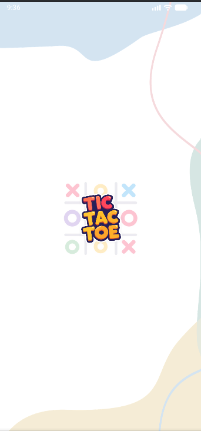
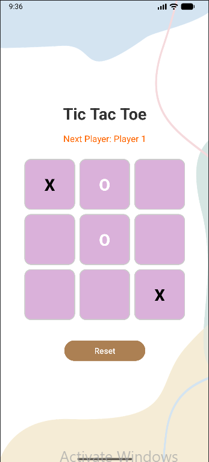
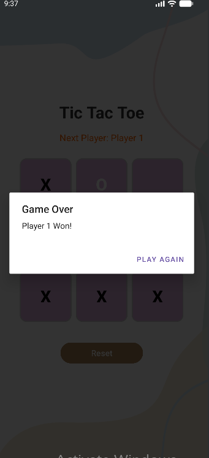

# Tic Tac Toe

A simple two-player Tic Tac Toe game built with Kotlin for Android.

## Features

- Two-player local gameplay (Player 1 vs Player 2)
- Splash screen with custom logo
- Win detection with dialog popup
- Draw detection
- Reset button to restart the game
- Clean and simple user interface
- Built using Android View Binding

## Project Structure

```text
app/src/main/
├── java/com/example/tictactoe/
│   ├── SplashActivity.kt
│   ├── MainActivity.kt
│   └── GameLogic.kt
├── res/
│   ├── layout/
│   │   ├── activity_splash.xml
│   │   └── activity_main.xml
│   ├── drawable/
│   │   ├── cell_border.xml
│   │   └── your_logo.png
│   ├── values/
│   │   ├── strings.xml
│   │   ├── colors.xml
│   │   └── styles.xml
└── AndroidManifest.xml
```
## Screenshots

| Splash Screen | Game Board | Winner Dialog |
|---------------|------------|---------------|
|  |  |  |


## How It Works

### Splash Screen

- Displays the application logo when the app launches
- Automatically navigates to the main game screen after a short delay

### Game Logic

- Tracks player turns
- Updates the game board after each move
- Checks for winning combinations
- Detects draw conditions
- Displays result dialogs
- Supports game reset functionality
